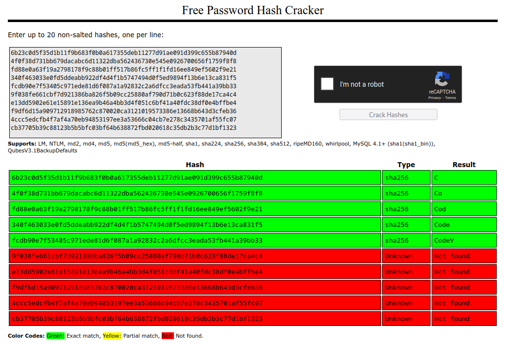

# Crypto > crackme

## Description

```
can u beat that?

Author: @benjamin
```

## Files

* [output.txt](output.txt)

## Solution

* [solve.py](solve.py)

The file contains 55 lines of what look like SHA256 hashes. The title hints at cracking, so I ran them through crackstation.net. First few were cracked, revealing a pattern suggesting that each hash uses the same input as the previous, but with a new character added each time. We can bruteforce this password one character at a time, using each new hash to verify each new character.



```python
import string
from hashlib import sha256

with open('output.txt') as f:
    lines = f.read().strip().splitlines()

password = ''

for line in lines:
    for c in string.printable:
        if line == sha256((password + c).encode()).hexdigest():
            password += c
            break

print(password)
```

## Flag

`CodeVinciCTF{bruteforced_like_bike_keylock_pins_0e3cw7}`
