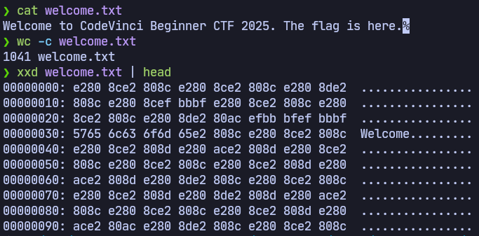

# Intro > Sanity Check

## Description

```
I'm in a hurry, I'll leave you the message in the attachments...
```

## Files

* [welcome.txt](welcome.txt)

## Solution

The file appears to contain a short message, but actually encodes the flag using many zero-width characters. I had to try a few zero-width space steganography websites before [finding one that could decode it](https://330k.github.io/misc_tools/unicode_steganography.html)


## Flag

`CodeVinciCTF{flag_is_here_for_real_z8q2k}`
