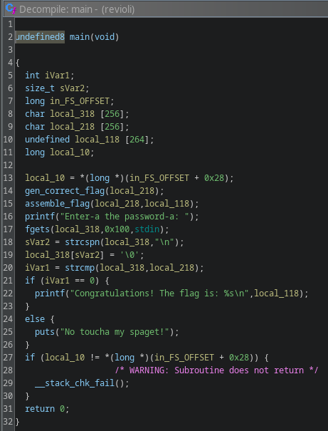
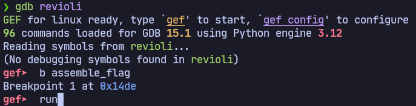
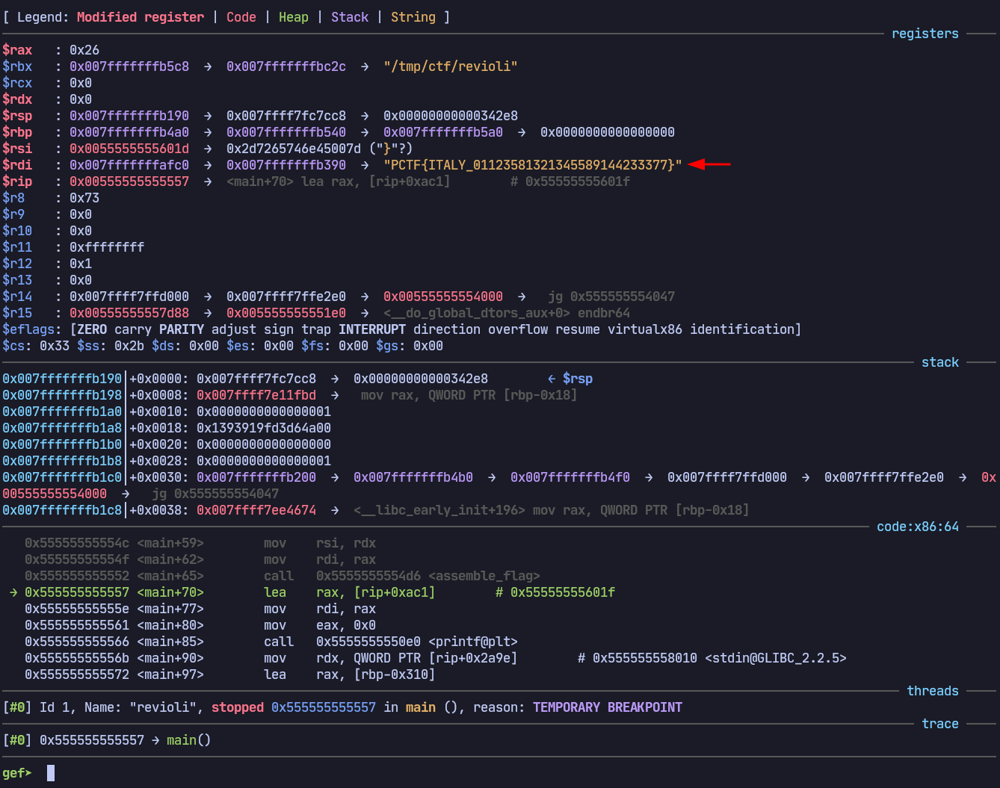

# Revioli, Revioli, give me the formeoli

## Description

Can you unlock the secret formula?

Author: Shiloh Smiles (arcticx)

## Files

* [revioli](revioli)

## Solution

We're given a binary program `revioli` which prompts us for a password before printing a success/error message. The challenge title hints at an "Italian" theme, possibly a playful reference to the password validation process involving "formeoli" or formulas.

We can import the executable into Ghidra, then decompile various functions like `main` to roughly see what they're doing:

- The `main` function immediately calls `gen_correct_flag` and `assemble_flag`. These functions generate and assemble the flag before user input, meaning the flag is loaded into memory before any user interaction.

By using a debugger such as `gdb` with the [gef](https://github.com/hugsy/gef) extension, we can inspect memory to retrieve the flag.

### Steps:

1. Run `gdb revioli`
2. Set a breakpoint on `assemble_flag` using `b assemble_flag`
3. Start the program with `run`. It will pause execution at `assemble_flag` due to our breakpoint.
4. Use `finish` to step through the function and return to `main`.
5. Now, inspect registers and memory to find the flag. Using `gef`, we can see that the `rdi` register contains a pointer to the flag string in memory:

## Flag

`PCTF{ITALY_01123581321345589144233377}`
